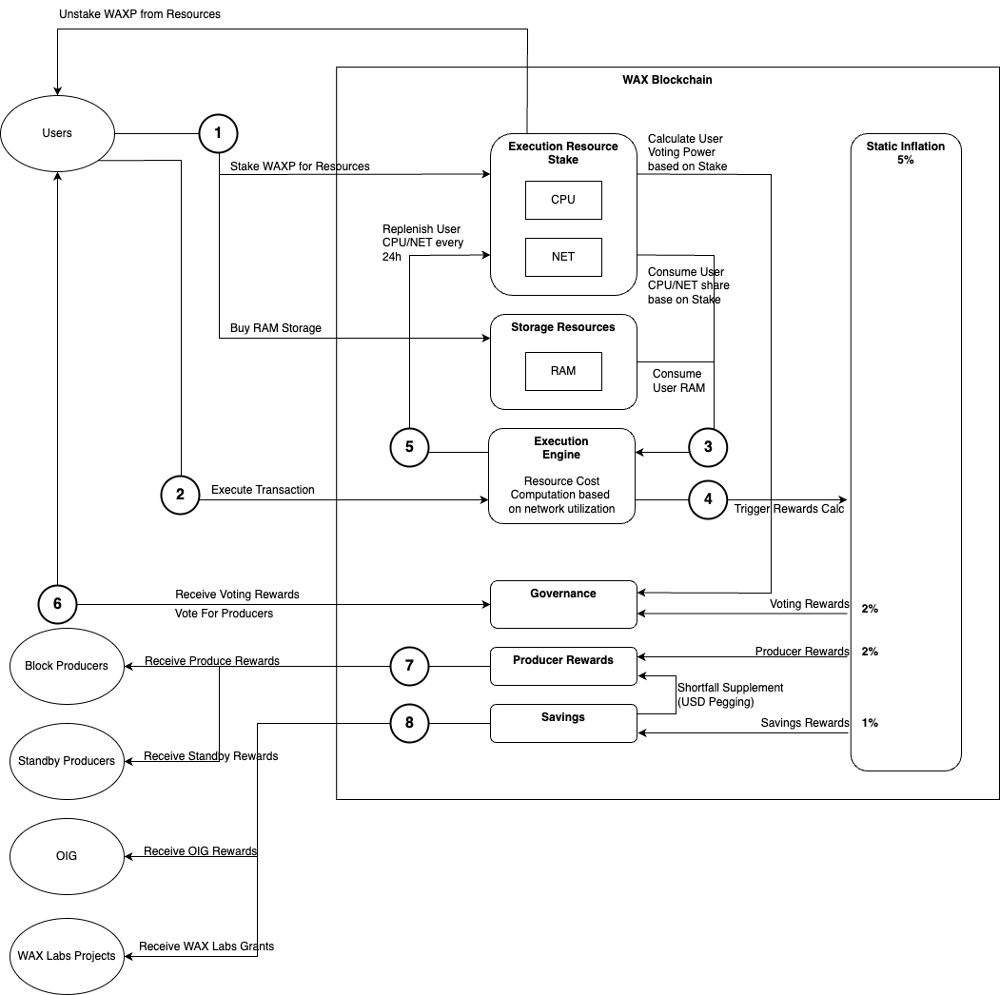
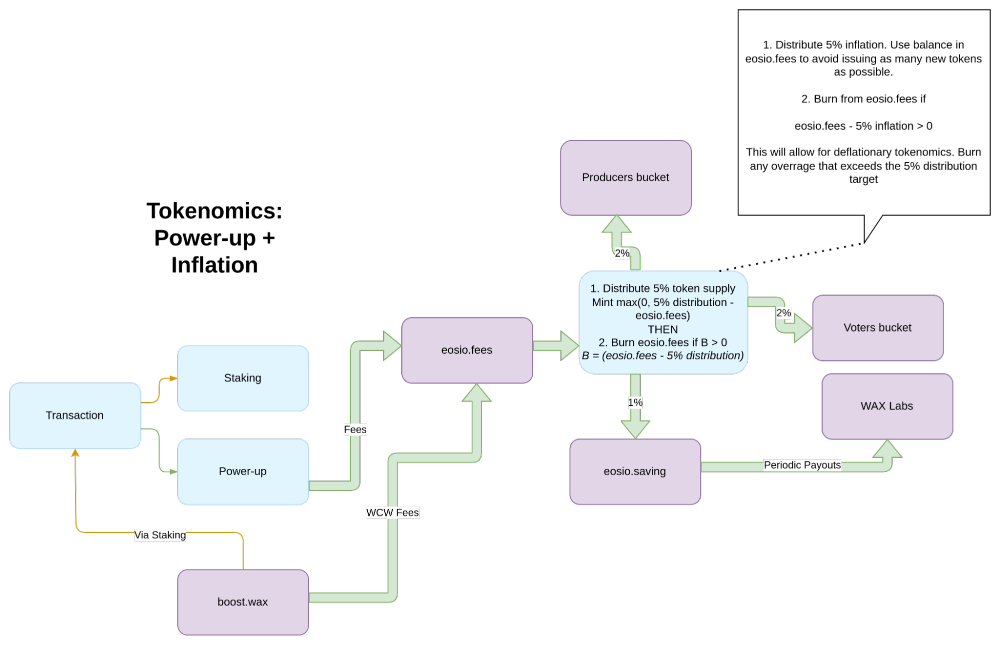
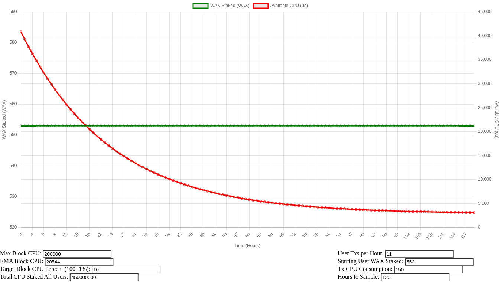
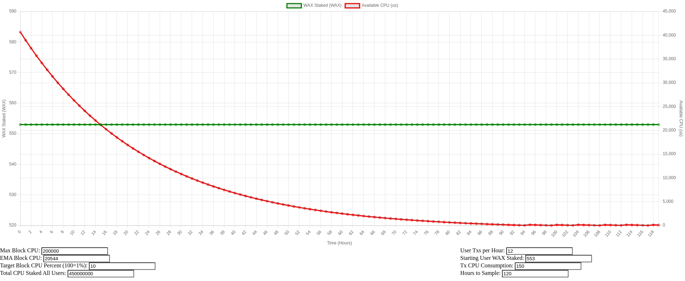

# WAX Tokenomics Upgrade

# Summary

WAX Blockchain tokenomics is being redesigned in order to reduce the on-chain inflation rate and to ensure that on-chain activities can start funding the cost associated with the wax blockchain chain operations.

Todays model utilizes static 5% yearly inflation to fund operations with 2% being used to pay block producers and standby producers, 2% being used to pay for rewards to users participating in chain governance via staking and voting and 1% being used to fund blockchain savings account used to pay for community projects via WAX Labs and other business development activities.

The execution engine of the wax blockchain that is responsible for pricing resources and metering the cost of transaction per user is based on a resource staking model. That model allows users to stake waxp to reserve CPU and NET bandwidths while also allowing them to purchase RAM storage. That reservation is then evaluated at runtime to determine how much each user’s stake can yield per block produced based on chain utilization at that time. In other words the same amount of stake can yield more bandwidth if the wax blockchain is not busy or it can yield less bandwidth during surge times. Users need to ensure that in order for them to perform operations reliably they have enough wax staked to match how busy the chain is. Resources stake is a renewable resource and consumed bandwidth goes on a 24h cooldown after which period is again available to a user.

Resource staking and wax blockchain transaction rate need to be correlated to on-chain inflation and operations cost. In theory, users having to stake waxp tokens for resources should create enough demand for waxp tokens to keep equilibrium between demand and supply as long as the chain transaction rate continues to increase. Due to the fact that resource stake is renewable, that rate of activity increase would have to generate enough demand for waxp staking to match the chain inflation rate in order to keep the equilibrium. However, during bear markets when activity decreases or remains constant the current resource staking model is not in equilibrium and tokens generated via inflation are not being consumed for resource staking.

This creates an environment where resources needed to execute a transaction are indirectly, heavily subsidized by inflation creating unnecessary waxp sell pressure in the ecosystem.

Current Tokenomics

LEGEND

1. Users stakes WAXP for NET and/or CPU bandwidth
2. Users execute a transaction
3. Execution engine calculates how many resources a user's current stake can provide in the context of a block produced; that stake is then consumed and put on 24h cooldown. Additionally if storage is needed for a transaction then the user's RAM is permanently consumed. Users can decide to delete resources later on freeing RAM and allowing for that RAM to be sold on an open RAM marketplace.
4. Each block triggers an Inflation Rewards mechanism that mints tokens and funds Voting Rewards, Producer rewards and Savings.
5. Users staked resources are taken off cooldown and available for usage again.
6. Users receive voting rewards equal to their voting power calculated based on their staked percentage.
7. Producer rewards are distributed to voted in Block Producers and Standby Producers
8. Projects and Business Development are funded from Savings

The WAX team is working on redesigning the current model by adding more parameters allowing calibration of the staked resource renewability mechanism. Additionally, new parameters will also be added to allow better algorithmic calibration of how much resource stake is needed to execute a transaction in correlation with on chain activity.

WAX is introducing a hybrid transaction execution model, integrating the EOS Powerup and traditional EOS staking methods for resource allocation. This approach allows users to fund transactions directly from their WAX balance using a powerup action, similar to the one on the EOS mainnet. Users can manually activate this powerup whenever needed. Many wallet services, including the Wax Cloud Wallet, are equipped with tools to automatically invoke powerups when a user's resources are low, facilitating seamless management and enabling users to make informed choices about incurring powerup fees for their transactions.

Staking remains an option for transaction execution, and to startout will provide a 10:1 ratio of staking to powerup weight. This structure significantly reduces the immediate cost of executing a transaction through powerup while staking remains an option for users who prefer it, albeit requiring significantly more WAX to be locked up for equivalent transaction throughput as that of a user opting for powerups.

This change to the tokenomics model is a first step to provide a stronger link between on-chain activity and chain operations costs with the ultimate goal being bringing wax blockchain inflation to zero or negative inflation.

Future Tokenomics

# Summary of Changes

1. Adoption of a hybrid transaction execution model combining classic resource staking and Powerup; whereby Powerup resources will have access to system resources in a ratio of 1 to 10, Powerup to Staking. This ratio may be adjusted as chain activity is monitored during and after roll-out.
2. Variable inflation mechanics allowing for the possibility of WAX deflation. Inflation will be capped at 5% and offset in real-time by fees collected from Powerup to potentially allow for deflationary situations when the chain is heavily utilized.

## Powerup Fee Behaviour

Dynamics to realize:

* Users will have the option to choose staking OR powerup as their mechanism to execute transactions.
* Powerup parameters will initially roll out with values very similar to EOS Mainnet, but scaled to the WAX token supply.
* The power up resource pool will be 1/10th the weight of the staking resource pool. Despite that, the power-up fees will be very cost effective and should be an attractive option for many users over staking
* The resulting balance of stake weight versus powerup weight will allow a typical staker to execute about 10 transactions per hour with typical weights
* The elastic multiplier will be effectively disabled so as to tighten chain resource usage to its true burden during slow times. Since powerup is expected to be extremely cheap during slow times this will provide a good alternative for the ecosystem and should contribute towards aligning usage costs with chain activity.

## Initial rollout powerup fee function vs staking

[Fig 1. Powerup Launch Configuration](https://rawcdn.githack.com/worldwide-asset-exchange/wax-system-contracts/1f379e1fba1db625a4fb850e58c33deee4699618/tokenomics/powerup.html?&minPrice=8750&maxPrice=262500&powerupWeight=1&stakeWeight=10&stakePoolValue=386500018&waxUSDSpotPrice=0.067&resourcePctReservation=0.1)

## Staking Behavior

The following graph shows how the resulting changes will affect staking for a typical user. Staking only 500 WAX for CPU, this kind of user can send at least 11 typical transactions (token transfers) per hour indefinitely when the chain is under current average loads of about 25% maximum chain load. See the situation modeled in the following diagrams.

[Fig 2. Staking Basic User Max Tx/Hr](https://rawcdn.githack.com/worldwide-asset-exchange/wax-system-contracts/1f379e1fba1db625a4fb850e58c33deee4699618/tokenomics/stake.html?&inputMaxBlockCPU=200000&inputEMABlockCPU=20544&inputTargetBlockCPUPct=10&inputTotalStakedAllUsers=450000000&inputTxPerUserPerHour=11&inputStartingWAXBalance=553&inputTxCPUConsumption=150&inputHours=120)

In this diagram we see the user is able to accomplish 11 transactions per hour without hitting staking limits

[Fig 3. Basic User Just Exceeds Max Tx/hr](https://rawcdn.githack.com/worldwide-asset-exchange/wax-system-contracts/1f379e1fba1db625a4fb850e58c33deee4699618/tokenomics/stake.html?&inputMaxBlockCPU=200000&inputEMABlockCPU=20544&inputTargetBlockCPUPct=10&inputTotalStakedAllUsers=450000000&inputTxPerUserPerHour=12&inputStartingWAXBalance=553&inputTxCPUConsumption=150&inputHours=120)

In this diagram we see the user eventually hits staking resource limits at 12 transactions per hour

Beyond this threshold, the user will have to either increase their stake or utilize powerup for further transactions.

# Code Changes

System contracts Powerup MR: [https://github.com/worldwide-asset-exchange/wax-system-contracts/pull/83](https://github.com/worldwide-asset-exchange/wax-system-contracts/pull/83)
